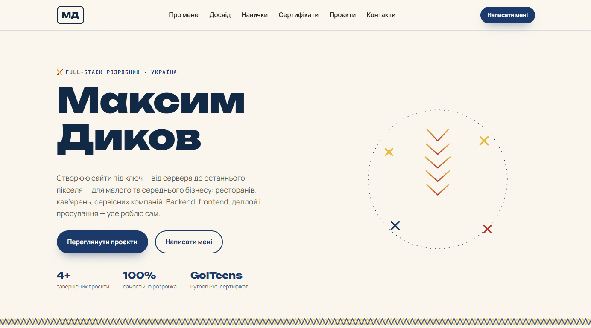
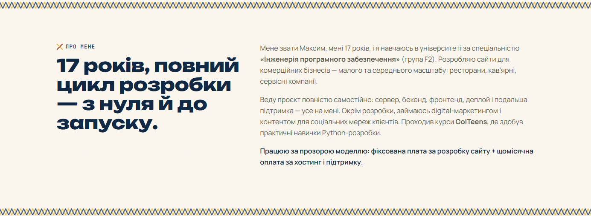
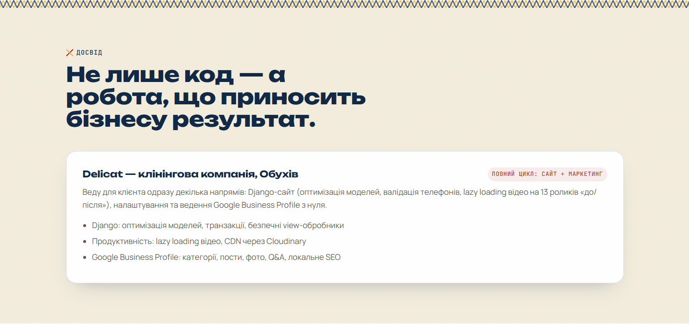
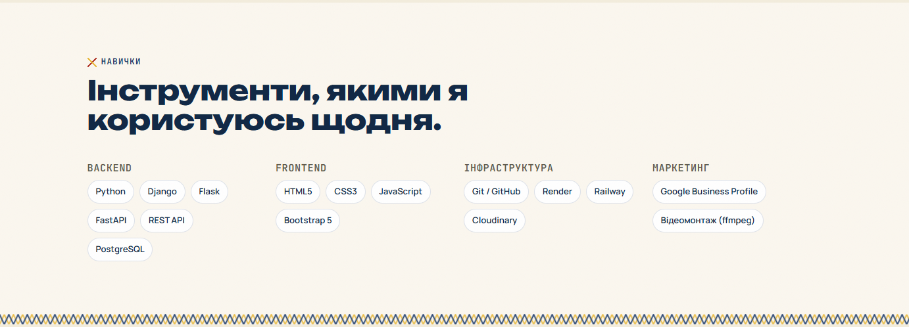
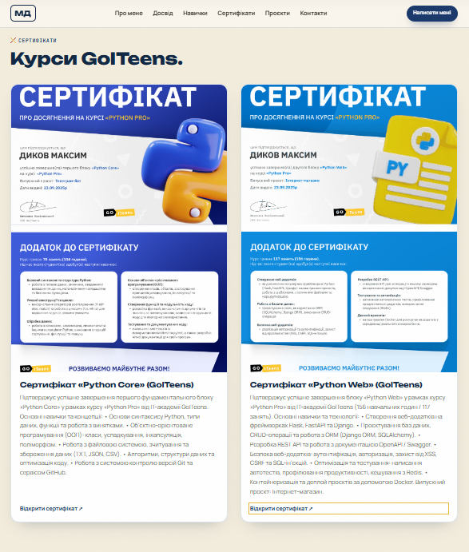
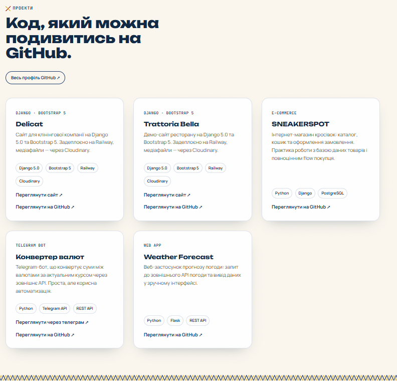
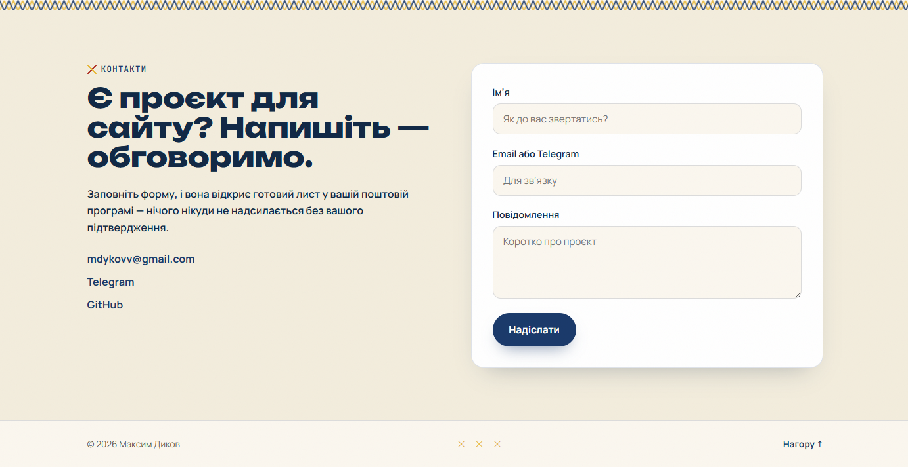

# Web Developer Portfolio


Modern, responsive web developer portfolio site showcasing projects, services, interactive cost calculators, and client inquiry forms. Built with **Django**, **JavaScript**, and clean **HTML5/CSS3**.

## Features

- **Modern & Responsive Layout**: Mobile-friendly design optimized for desktops, tablets, and smartphones
- **Project Showcase**: Display of recent web applications, landing pages, and commercial work
- **Interactive Price Calculator**: Client-facing calculation logic for dynamic project cost estimates
- **Lead Capture & Contact Form**: Integrated contact form submitting directly to backend/database
- **Optimized Performance**: Fast asset loading and clean architectural separation of templates, scripts, and views
- **Admin Management**: Django Admin integration for quick content, leads, and services updates

## Tech Stack

- **Backend**: Python 3, Django
- **Frontend**: HTML5, CSS3, JavaScript (ES6+)
- **Database**: PostgreSQL (Production) / SQLite (Development)
- **Deployment & Static Storage**: WhiteNoise, Gunicorn, Railway / Cloudinary
- **Environment Management**: python-dotenv

## Screenshots

**1. Main Hero & Presentation**  


**2. About me**  


**3. Experience**  


**4. Tools**  


**5. Certificates**  


**6. Portfolio Showcase**  


**7. Contact & Inquiry Form**  


## Project Structure

```text
Portfolio/
├── portfolio/              # Django core application
│   ├── static/             # Front-end assets
│   │   ├── css/            # Custom styles & responsive media queries
│   │   ├── js/             # Interactive logic & form handling
│   │   └── img/            # Site icons & background assets
│   ├── templates/          # HTML templates
│   │   ├── base.html       # Base layout blueprint
│   │   └── index.html      # Main landing page template
│   ├── admin.py            # Admin models registration
│   ├── models.py           # Database models (Projects, Services, Leads)
│   ├── urls.py             # App route definitions
│   └── views.py            # HTTP request handling & dynamic logic
├── config/                 # Root project configuration
│   ├── settings.py         # Django project settings & environment loading
│   ├── urls.py             # Global URL routing
│   └── wsgi.py             # WSGI deployment entry point
├── .env.example            # Environment variables template
├── .gitignore              # Files excluded from git tracking
├── manage.py               # Django CLI utility script
└── requirements.txt        # Project dependencies list